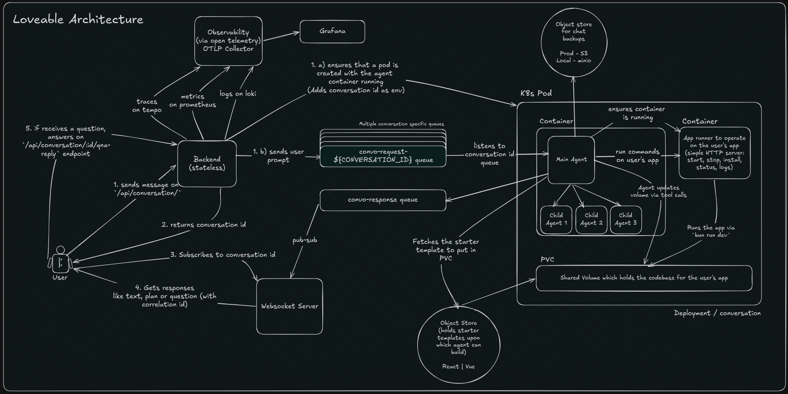

# Loveable Clone

Loveable Clone is a Kubernetes-native coding-agent platform for generating and iterating on live web apps. It provisions an isolated workspace per conversation, persists project state on PVC-backed storage, serves previews through Services and Ingress, and streams agent progress back to the browser while a custom agentic harness edits the app.

The system coordinates an authenticated backend API, Redis job queues and Pub/Sub, WebSocket updates, Kubernetes deployments, an agent worker, an app runner, Postgres persistence, S3-compatible backups, sub-agent orchestration, and full backend observability across traces, metrics, and logs.

## Current Capabilities

- Create conversations and store them in Postgres.
- Accept user messages and persist them immediately so prompts are not lost if agent execution fails later.
- Create or reuse a dedicated Kubernetes pod for each conversation.
- Inject environment variables, mount a shared PVC, and start the agent and app-runner containers inside the pod.
- Queue work through Redis so messages are not lost while pods are starting.
- Run a custom agent harness that loads conversation history, reads and edits project files, invokes Gemini/tooling, saves assistant messages, and publishes progress through Redis Pub/Sub for WebSocket delivery.
- Bootstrap new apps by downloading starter templates from S3, or from MinIO during local development, into the shared PVC workspace.
- Back up chat history to an S3-compatible object store, using MinIO locally, so long-running conversations can survive agent crashes and later returns.
- Orchestrate sub-agents from the main agent for isolated parallel work via tool call.
- Run each sub-agent in its own Git worktree inside the shared PVC, collect diff artifacts, and let the main agent apply the returned patches.
- Run a separate app-runner container that manages the generated application's dev server.
- Stream real-time status updates through Redis Pub/Sub, backend subscriptions, WebSockets, and the browser.
- Persist conversation history in Postgres so pods can be recreated and context can be restored from the database.
- Expose generated app previews through Kubernetes Services and Ingress.
- Authenticate requests while allowing anonymous users to start work and later claim their account.
- Export backend traces, metrics, and logs through OpenTelemetry to the local observability stack.

---

## System Architecture

The ecosystem consists of several specialized microservices built on k8s cluster communicating via event driven messages:


```text
                    Browser
                       |
                HTTP + WebSocket
                       |
                 Backend API
                       |
        +--------------+--------------+
        |                             |
 Save conversation              Subscribe to
   in Postgres                  Redis Pub/Sub
        |                             |
        +--------------+--------------+
                       |
       Ensure conversation pod exists
                       |
                  Redis Queue
                       |
                  Agent Worker
                       |
          Kubernetes conversation pod
                       |
      +----------------+----------------+
      |                                 |
 Agent Worker Container          App Runner Container
      |                                 |
 Gemini + tools                  bun install
 Edit files                      bun run dev
 Spawn sub-agents                restart on file changes
 Apply artifacts                 expose preview server
 Save messages
 Publish progress
      |                                 |
      +---------- Shared Volume --------+
                       |
            App Runner Dev Server
                       |
              Kubernetes Service
                       |
                    Ingress
                       |
        conversation-id.preview.local
```

## Request Flow

```text
User
 |
 | POST /messages
 v

Backend
 |
 +-- Save conversation
 +-- Save user message
 +-- Ensure Kubernetes pod exists
 +-- Push job to Redis queue
 +-- Return immediately
         |
         v

Agent Worker
 |
 +-- Pick job from Redis queue
 +-- Load conversation history
 +-- Run Gemini
 +-- Execute tools
 +-- Download starter template from S3/MinIO when needed
 +-- Optionally fork sub-agents over IPC
 +-- Collect sub-agent artifacts from isolated worktrees
 +-- Apply returned patches
 +-- Write files
 +-- Back up chat history to object storage
 +-- Save assistant messages
 +-- Publish progress
         |
         v

Redis Pub/Sub
         |
         v
Backend
         |
         v
WebSocket
         |
         v
Browser receives live updates
```

## App Runner

The app runner is a dedicated container in the same pod as the agent. It is responsible only for running the editable application, not for agent logic.

It watches the shared project directory, runs dependency installation, starts `bun run dev`, restarts automatically when files change, exposes the dev server, and provides a preview URL through ingress.

The agent edits files directly on the shared volume. It does not start or manage the dev server itself.

## Project Bootstrap And Backups

The `startBuildingApp` tool in `apps/agent/src/services/agentServices/startBuildingApp.ts` prepares a new project when there is no code yet. It downloads a starter template archive, such as the React starter, from the configured S3 starter-template bucket and extracts it into the PVC-backed workspace. In local development the same S3 API is served by the MinIO container, so the flow matches production without requiring AWS.

Chat history is backed up to the configured chat-history object store through the agent response handler. Each backup is written as a timestamped object and copied to a latest backup key for the conversation; local development uses the same path against MinIO.

## Sub-Agent Orchestration

The main agent can delegate independent work to sub-agents through `SubAgentOrchestrator` in `apps/agent/src/services/subAgentOrchestrator.ts`.

Sub-agents are spawned with `fork`, communicate completion or failure back to the parent process over IPC, and write their work as artifacts. Each sub-agent runs in a separate Git worktree inside the PVC-backed workspace. When a sub-agent finishes, it creates a diff artifact from its worktree, cleans up the worktree, and returns the artifact path to the main agent. The main agent reads those artifacts and applies the patches to the primary workspace.

## Repository Layout

```text
apps/
  agent/              Agent worker that processes queued jobs and edits projects
  app-runner/         Container process that installs and runs generated apps
  backend/            Express API for conversations, messages, queues, and pods
  frontend/           React/Vite frontend for the user-facing app
  project/            Editable React/Vite project workspace
  project-template/   Template used for new editable projects
  websocket/          WebSocket server for live browser updates

packages/
  db/                 Drizzle/Postgres schema and database access
  observability/      OpenTelemetry SDK setup, tracing helpers, metrics, and log export
  shared/             Shared types, schemas, and utilities

observability/        Tempo, Prometheus, Loki, and OTel Collector config mounted by Docker Compose
k8s/                  Kubernetes namespace, RBAC, PVC inspection, and ingress templates
ops/                  Dockerfiles for agent and app-runner containers
```

## Technology Stack

| Layer                   | Technology                                            |
| ----------------------- | ----------------------------------------------------- |
| Frontend                | React, Vite                                           |
| API                     | Express, TypeScript                                   |
| Database                | PostgreSQL, Drizzle ORM                               |
| Queue                   | Redis                                                 |
| Live events             | Redis Pub/Sub, WebSockets                             |
| AI                      | Gemini                                                |
| Runtime/package manager | Bun                                                   |
| Containers              | Docker                                                |
| Orchestration           | Kubernetes, currently Minikube                        |
| Workspace               | Shared volume inside each conversation pod            |
| Networking              | Kubernetes Services and Ingress                       |
| Observability           | OpenTelemetry, OTLP, Tempo, Prometheus, Loki, Grafana |

## Local Development

Install dependencies:

```sh
bun install
```

Run all workspace dev tasks through Turborepo:

```sh
bun run dev
```

Run the root checks:

```sh
bun run build
bun run lint
bun run check-types
```

Run database commands from the database package:

```sh
bun --filter @repo/db db:generate
bun --filter @repo/db db:push
bun --filter @repo/db db:migrate
bun --filter @repo/db db:studio
```

Start the local observability stack:

```sh
docker compose up
```

This starts Tempo, the OpenTelemetry Collector, Prometheus, Loki, and Grafana using the configuration in `observability/`. The backend initializes `@repo/observability` before lazy-loading the server so OpenTelemetry auto-instrumentation can patch supported dependencies before they are imported.

## Observability

The backend exports telemetry over OTLP through the OpenTelemetry Collector:

- traces are sent to Tempo
- metrics are exposed for Prometheus
- logs are sent to Loki
- Tempo, Prometheus, and Loki are added as Grafana data sources

The reusable OpenTelemetry setup lives in `packages/observability`, while service configuration for Tempo, Prometheus, Loki, and the OTel Collector lives in the root `observability/` directory and is mounted into containers by `docker-compose.yml`.

## Kubernetes

The Kubernetes setup is designed around one isolated pod per conversation. The backend ensures the pod exists before queueing work for the agent. Each pod contains:

- an agent worker container
- an app-runner container
- a shared volume for project files
- service/ingress routing for preview access

Relevant manifests and templates live in `k8s/`, while container build definitions live in `ops/`.

## Design Decisions

- Conversation history is stored in Postgres, not in process memory.
- User messages are saved before agent execution starts.
- Agent work is asynchronous and queued through Redis.
- Each conversation gets an isolated Kubernetes execution environment.
- PVC-backed workspaces keep project files independent of pod lifecycle.
- The agent and app runner communicate through a shared filesystem, not file copying.
- Live progress is published through Redis Pub/Sub and forwarded over WebSockets.
- Crash recovery works by recreating the pod, reloading state from the database, and keeping chat-history backups in S3-compatible object storage.

## Roadmap

Near-term areas called out for the project:

- Faster local developer workflow, including better Minikube ergonomics and potentially hostPath mounts for the inner loop.
- Production readiness work such as authorization, secrets management, autoscaling, resource limits, retry/dead-letter handling, and WebSocket scaling across multiple backend replicas.
